# LiteraryFlow 当前功能流程梳理

本文档基于当前项目已实现内容整理，目标是把现阶段产品流程、功能边界、页面关系、运行逻辑和未闭环部分说明清楚，便于后续做需求调整、结构重构和功能扩展。

文档强调“功能是什么、流程怎么走、用户能做什么、系统会发生什么”，不涉及具体方法名和底层实现细节。

## 1. 文档目的

- 作为当前版本的产品现状底稿
- 作为后续重构前的功能边界确认文档
- 作为新增需求评估时的对照基线
- 作为后续 PRD、流程设计、模块拆分的输入材料

## 2. 产品定位

当前项目本质上是一个 Android 自动化任务编排与执行工具，核心目标包括：

- 为指定应用配置自动化任务
- 通过无障碍能力执行点击、滑动、输入、返回等操作
- 在常规界面元素识别不足时，结合截图和文字识别完成找字、点字、定位
- 通过悬浮窗控制任务的启动、暂停、重跑和查看进度
- 通过定时、每周、循环等方式安排任务自动执行

从现状看，项目已经具备“任务配置器 + 运行控制台 + 自动执行引擎 + OCR 辅助能力”的完整雏形。

## 3. 用户使用前提

在当前版本中，用户要顺利使用主要能力，需要先满足以下前提：

- 开启无障碍服务
- 开启悬浮窗权限
- 在需要 OCR 或截图取点时，授权录屏权限
- 在部分运行判断场景下，授予使用情况访问权限
- 至少先选择一个目标应用，再去配置任务或条件

## 4. 全局业务总览

### 4.1 主业务闭环

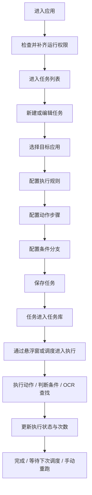

### 4.2 当前系统由五条主线组成

- 配置主线：创建任务、编辑任务、动作配置、条件配置、应用选择
- 运行主线：任务调度、任务执行、进度反馈、暂停与重跑
- 辅助主线：截图取点、文本取点、OCR 标注、录屏支撑
- 数据主线：任务存储、导入导出、分组展示、状态更新
- 扩展主线：监听、通知、HTTP、网站检测、实验页

## 5. 页面与功能结构

### 5.1 首页层

首页当前承担的是“能力入口”和“权限入口”角色，主要功能包括：

- 打开自动化任务列表
- 请求或跳转到系统权限页
- 开启录屏相关能力
- 开启主控悬浮窗
- 预留视频和音乐等未来功能入口

### 5.2 任务列表层

任务列表页当前承担的是“任务资产管理中心”角色，主要功能包括：

- 查看全部自动化任务
- 按目标应用分组查看任务
- 新增任务
- 编辑已有任务
- 删除任务
- 开关任务启用状态
- 导入 JSON 任务数据
- 导出 JSON 任务数据

### 5.3 任务编辑层

任务编辑页是当前配置主线的核心页面，主要负责：

- 设置任务名称
- 选择目标应用
- 设置任务执行次数
- 设置步骤间隔
- 选择循环方式
- 配置每日时间范围
- 配置每周执行日
- 配置动作步骤列表
- 配置条件列表
- 配置监听规则列表
- 保存或更新任务

### 5.4 动作编辑层

动作编辑页负责把“单个执行步骤”配置完整，当前支持：

- 点击坐标
- 点击文字
- 左右滑动
- 上下滑动
- 上滑、下滑、左滑、右滑
- 输入文字
- 返回
- 打开应用
- 长按
- 执行另一个任务

同时还能配置：

- 单个动作的重复次数
- 动作执行后的等待时间
- 文字查找超时时间
- 文本匹配方式
- 文本来源方式

### 5.5 条件编辑层

条件编辑页负责把“什么时候触发、触发后做什么”配置完整，当前支持：

- 文本出现条件
- 时间范围条件
- 条件成立后执行动作
- 条件成立后执行一个子任务链
- 条件不成立后执行动作
- 条件不成立后执行一个子任务链

当条件被作为监听项使用时，当前页面还支持：

- 配置监听规则
- 配置监听命中后的执行动作

但监听能力在运行链路中尚未完全闭环，见本文最后一节。

### 5.6 辅助配置层

辅助配置能力主要用于让用户更快拿到点击参数和文本参数，包括：

- 文本取点悬浮窗
- 截图取点悬浮窗
- OCR 标注悬浮窗
- 应用选择页

### 5.7 运行控制层

运行控制层由主控悬浮窗承担，当前主要功能包括：

- 展开和收起主控面板
- 按任务类型切换查看
- 按应用分组查看任务
- 单任务开关
- 单任务重跑
- 长按进入编辑
- 查看当前执行进度
- 手动暂停
- 关闭整个运行面板

## 6. 详细流程图

## 6.1 首页启动与权限准备流程

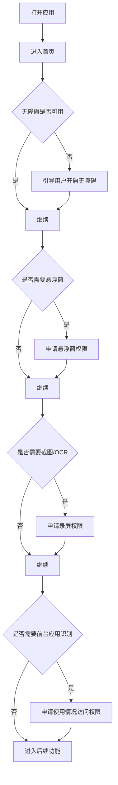

### 当前首页功能项

- 权限入口
- 自动化任务入口
- 录屏开启入口
- 录屏停止入口
- 主控悬浮窗开启入口
- 预留功能入口

## 6.2 任务列表管理流程

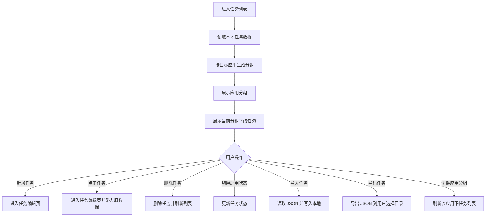

### 当前任务列表功能项

- 任务按应用分组展示
- 应用分组选中切换
- 当前应用下任务列表刷新
- 新建任务
- 编辑任务
- 删除任务
- 启用状态切换
- 任务导入
- 任务导出

## 6.3 新建任务流程

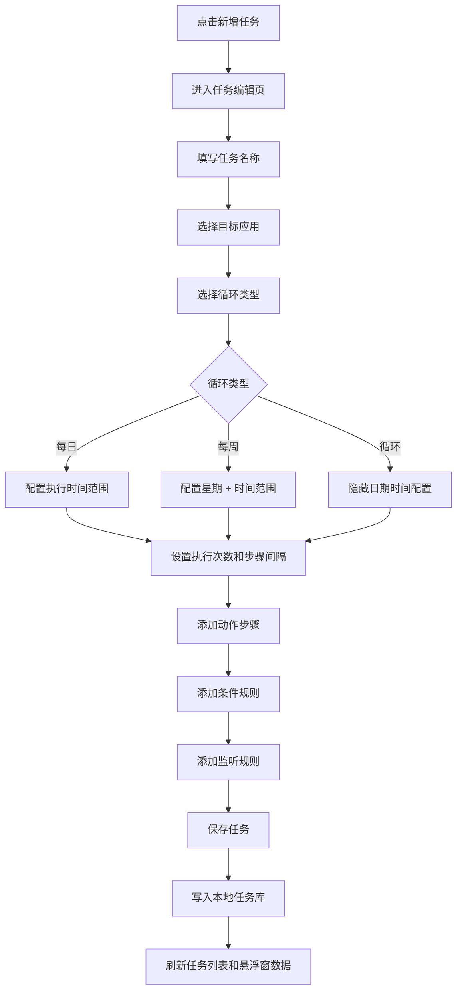

### 当前任务级配置项

- 任务名称
- 目标应用
- 是否允许自动拉起目标应用
- 循环类型
- 执行时间范围
- 每周执行日
- 执行次数
- 步骤间隔
- 动作步骤列表
- 条件规则列表
- 监听规则列表

## 6.4 编辑任务流程

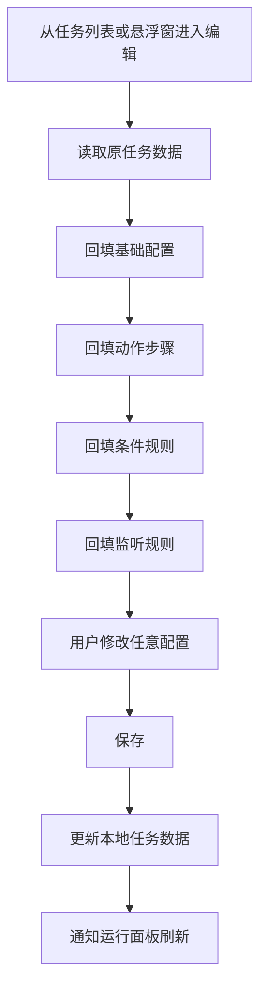

### 当前编辑时支持修改的内容

- 任务基础信息
- 应用选择
- 调度规则
- 执行次数
- 步骤间隔
- 动作顺序
- 条件顺序
- 监听项内容

## 6.5 动作添加流程

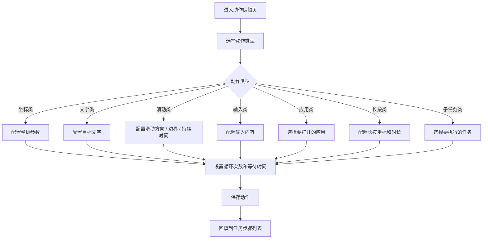

### 当前动作类型明细

- 点击坐标
- 点击文字
- 左右长滑
- 上下长滑
- 左滑
- 右滑
- 上滑
- 下滑
- 输入文字
- 返回
- 打开应用
- 长按
- 执行另一个任务

### 当前动作级配置项

- 动作类型
- 点击坐标
- 滑动起点
- 滑动边界
- 滑动持续时间
- 目标文字
- 文本匹配方式
- 文本识别来源
- 文本查找超时
- 输入内容
- 打开目标应用
- 长按时长
- 子任务引用
- 动作循环次数
- 动作后等待时间

## 6.6 动作参数取值流程

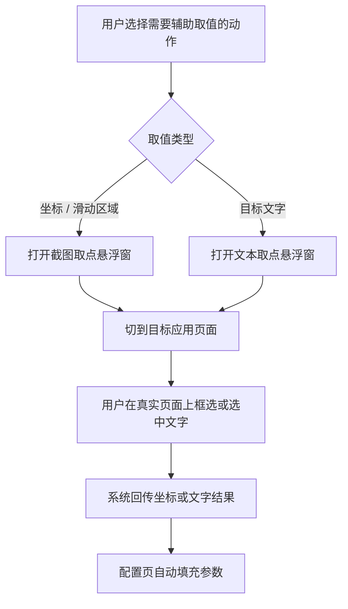

### 当前辅助取值能力

- 点击坐标取点
- 长滑范围取点
- 文本内容回填
- 文本中心点回填
- 配置页自动接收结果

## 6.7 条件配置流程

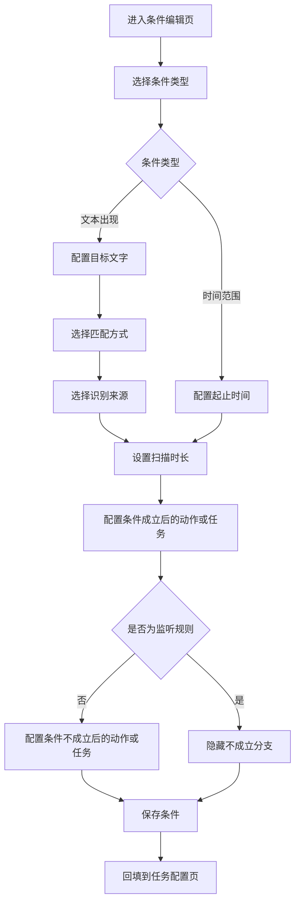

### 当前条件类型

- 文本出现条件
- 时间范围条件

### 当前文本条件配置项

- 目标文字
- 匹配方式
- 识别来源
- 扫描时长
- 命中后执行动作
- 命中后执行任务链
- 未命中后执行动作
- 未命中后执行任务链

### 当前监听规则配置项

- 监听目标文字
- 匹配方式
- 识别来源
- 扫描时长
- 命中后执行动作或任务

## 6.8 应用选择流程

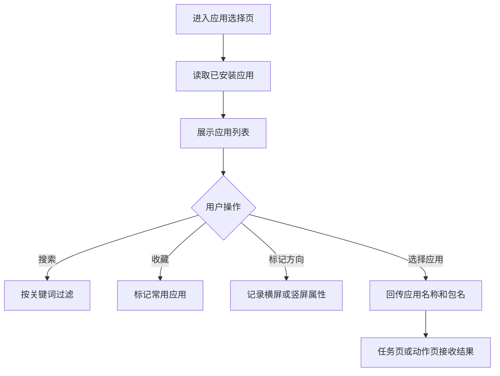

### 当前应用选择功能项

- 已安装应用读取
- 搜索应用
- 收藏应用
- 标记横屏应用
- 标记竖屏应用
- 回传应用信息

### 当前方向标记的业务意义

- 用于后续截图和录屏时判断屏幕方向
- 影响 OCR 和截图取图的方向配置

## 6.9 主控悬浮窗运行流程

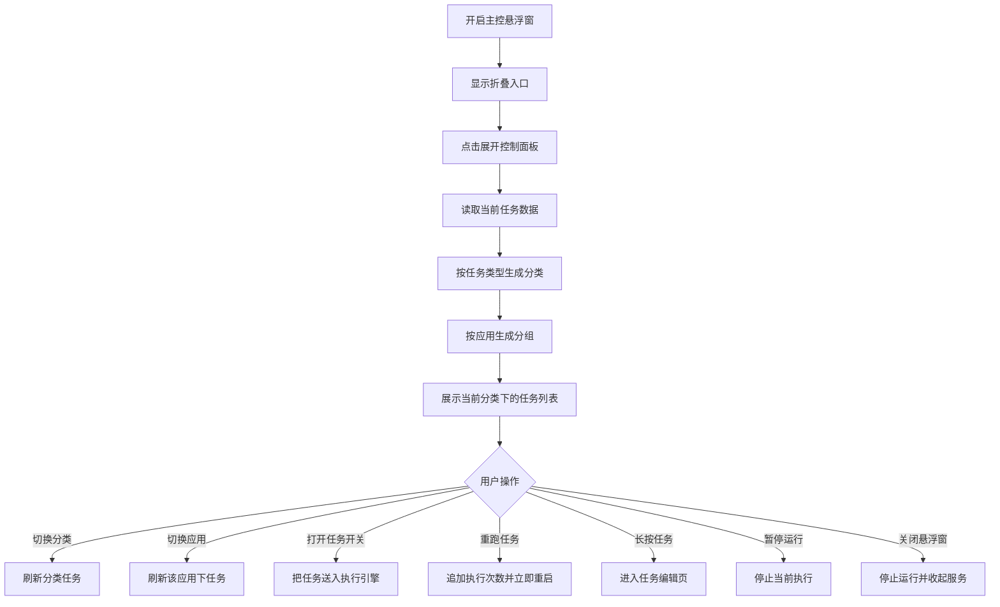

### 当前悬浮窗中的任务分类

- 每日任务
- 每周任务
- 无限循环任务
- 执行中任务
- 已完成任务

### 当前悬浮窗功能项

- 折叠入口
- 展开任务面板
- 按分类切换
- 按应用切换
- 单任务启停
- 单任务重跑
- 长按进入编辑
- 暂停当前运行
- 关闭悬浮窗
- 关闭时联动停止截图服务

## 6.10 任务执行总流程

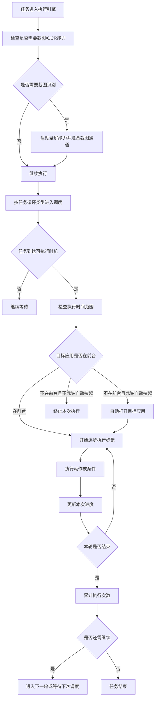

### 当前执行前检查项

- 是否具备截图通道
- 是否需要 OCR
- 当前时间是否在允许范围内
- 当前执行次数是否达到上限
- 当前目标应用是否在前台
- 是否允许自动打开目标应用

## 6.11 单个步骤执行流程

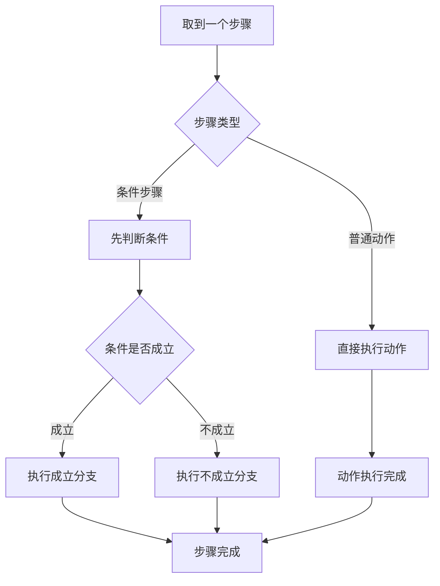

### 当前步骤支持两种结构

- 直接动作步骤
- 条件判断步骤

## 6.12 文本点击流程

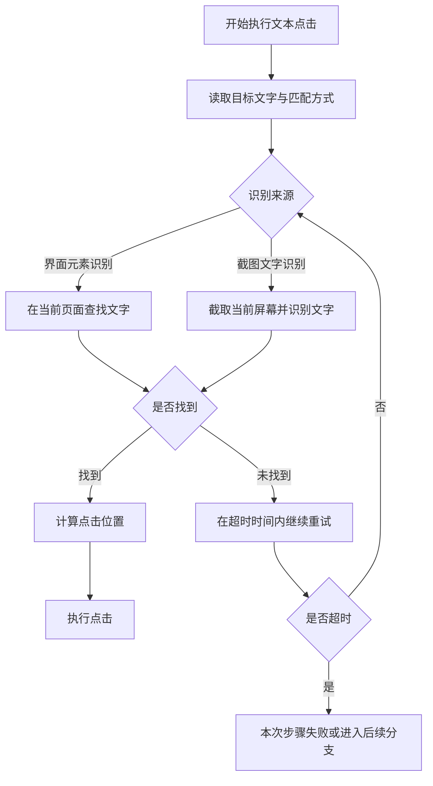

### 当前文本点击功能项

- 文本精确匹配
- 文本模糊匹配
- 多关键词模糊匹配
- 基于界面元素找字
- 基于截图 OCR 找字
- 找到后执行点击
- 超时重试

## 6.13 OCR 查找流程

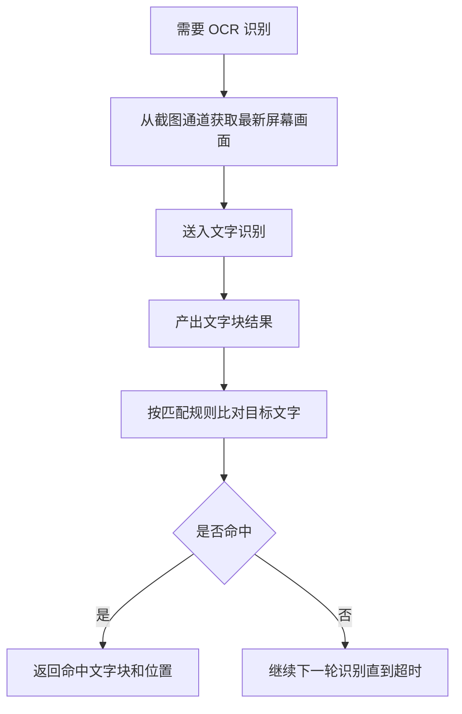

### 当前 OCR 相关功能项

- 截图抓取
- 中文文字识别
- 文字块定位
- 多轮重试
- OCR 结果标注展示

## 6.14 截图取点流程

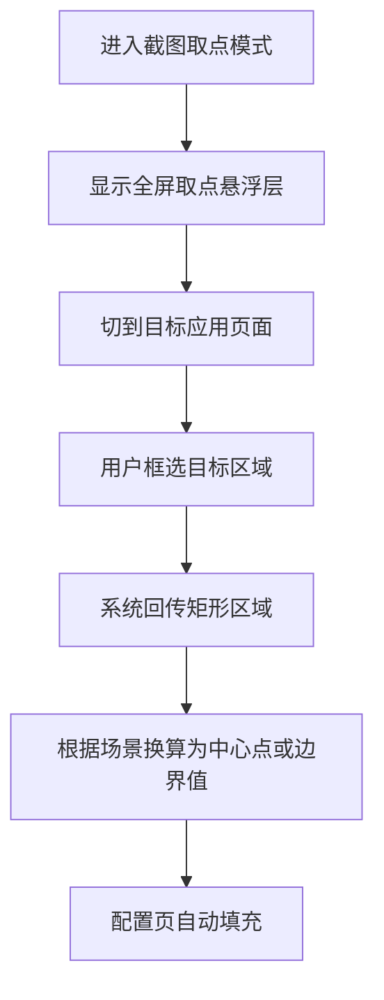

### 当前截图取点功能项

- 全屏浮层取点
- 矩形区域框选
- 中心点回填
- 滑动边界回填
- 暂停操作后截图

## 6.15 文本取点流程

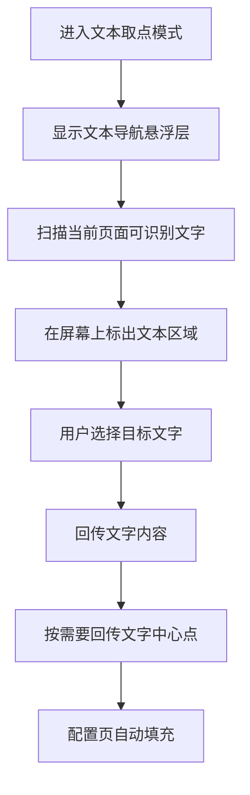

### 当前文本取点功能项

- 当前页面文本扫描
- 文本区域可视化
- 选中文字回填
- 文字中心点回填

## 6.16 任务导入导出流程

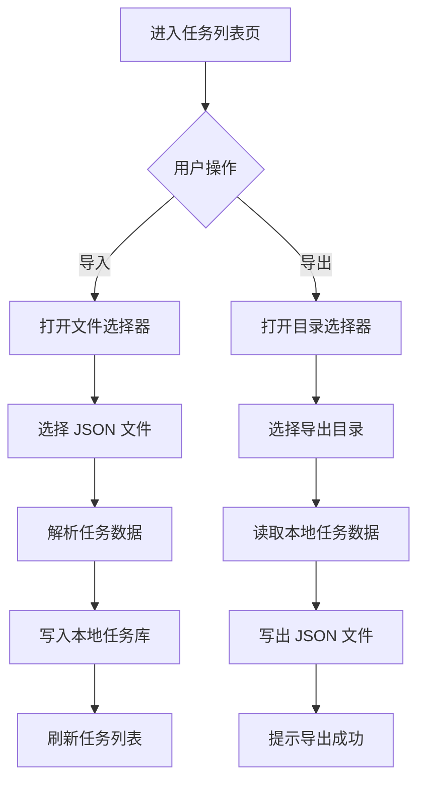

### 当前数据流转能力

- JSON 文件导入
- JSON 文件导出
- 从系统文件选择器读取
- 向用户指定目录写出

## 6.17 执行状态反馈流程

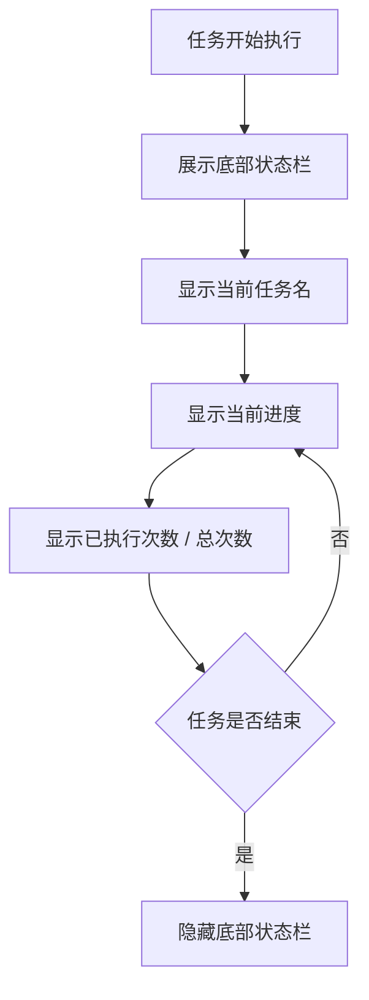

### 当前运行反馈项

- 当前任务名
- 当前任务分类
- 执行进度
- 已执行次数
- 总次数
- 任务结束后自动隐藏状态栏

## 7. 按功能域整理的现状说明

## 7.1 任务管理域

当前已实现：

- 任务新增
- 任务编辑
- 任务删除
- 任务分组展示
- 任务启用状态切换
- 任务 JSON 导入导出

当前特点：

- 任务是整个系统的核心数据单元
- 一个任务可以挂一个目标应用
- 一个任务可以同时带动作、条件、监听配置

## 7.2 动作编排域

当前已实现：

- 多种基础动作
- 多步骤串行组合
- 子任务嵌套引用
- 单步骤循环次数
- 单步骤等待时间

当前特点：

- 已具备轻量流程编排能力
- 更适合串行步骤，不适合复杂并行流程

## 7.3 条件判断域

当前已实现：

- 基于时间的条件判断
- 基于文本出现的条件判断
- 条件成立 / 不成立双分支

当前特点：

- 已经形成“简化版规则引擎”
- 可以支持较基础的分支自动化

## 7.4 调度运行域

当前已实现：

- 每日任务
- 每周任务
- 无限循环任务
- 同任务覆盖式调度
- 运行次数累计
- 跨天重置计数

当前特点：

- 已具备可长期运行的定时任务基础
- 运行与展示状态存在一定混合

## 7.5 OCR 与截图辅助域

当前已实现：

- 录屏授权接入
- 截图抓取
- OCR 识别
- OCR 标注浮层
- 截图取点
- 文本取点

当前特点：

- 这是项目与普通点击脚本相比最有辨识度的能力
- 已经能支撑“找字点击”和“页面取参配置”

## 7.6 悬浮窗控制域

当前已实现：

- 主控悬浮窗
- 文本取点悬浮窗
- 截图取点悬浮窗
- OCR 标注悬浮窗

当前特点：

- 已经构成一个运行态控制台
- 运行控制和页面配置之间存在明显联动

## 7.7 数据持久化域

当前已实现：

- 本地任务库存储
- 复杂任务结构持久化
- 导入导出能力
- 常用应用偏好记录

当前特点：

- 现有存储足够支撑当前单机版使用
- 后续若做多人协作、云同步、版本管理，需要单独升级数据模型

## 8. 当前尚未完全闭环的功能项

以下内容在项目中已经出现了入口、页面、数据结构或服务骨架，但从当前主线看，还没有完全形成稳定产品能力。

## 8.1 监听规则能力未完全接入执行主线

当前状态：

- 可以新增监听规则
- 可以保存监听规则
- 可以在编辑页展示监听规则

但当前问题：

- 监听规则没有稳定接入主任务执行循环
- 监听命中后的自动响应没有形成正式主链路

产品结论：

- 当前监听更像“已设计未完全落地”的功能

## 8.2 通知联动能力仍处于预留态

当前状态：

- 已有通知监听入口

但当前问题：

- 还没有形成“收到通知后触发任务”的完整业务流程

产品结论：

- 当前只能视为后续扩展点

## 8.3 本地 HTTP 能力仍处于预留态

当前状态：

- 已有本地服务入口

但当前问题：

- 还没有形成“外部请求驱动任务执行”的完整业务流程

产品结论：

- 当前属于骨架能力，不算主线功能

## 8.4 网站检测能力仍处于预留态

当前状态：

- 已有网站检测服务入口

但当前问题：

- 尚未进入稳定执行主线
- 未形成配置入口到执行结果的完整闭环

产品结论：

- 当前属于实验性方向

## 8.5 若干实验页和测试页未进入正式主流程

当前包括：

- 图片 OCR 测试页
- 截图实验页
- 调试日志页
- 演示页
- 练习页

产品结论：

- 这些页面可作为研发辅助能力保留
- 不应视为正式产品功能

## 9. 当前版本最适合作为后续改造基础的功能资产

如果后续要调整需求、重构架构、增加很多功能，当前最有价值的现成功能资产主要有：

- 任务模型已经成型
- 动作模型已经成型
- 条件模型已经成型
- 调度能力已经成型
- 悬浮窗控制链路已经成型
- 截图与 OCR 辅助能力已经成型
- 导入导出能力已经成型

这些能力说明当前项目不是从零开始，而是已经具备一个可重构、可扩展、可产品化的自动化底座。

## 10. 面向后续需求调整的建议关注点

后面如果要改需求，建议优先明确以下问题，因为它们会直接决定重构方式：

- 任务是继续“单机配置执行”，还是要升级成“流程编排平台”
- 动作是否要扩展为更丰富的原子能力
- 条件是否要支持多条件组合、条件组和优先级
- 监听是否要升级为正式实时触发体系
- 是否要支持变量、参数、上下文和结果回写
- 是否要支持任务模板、任务复制、任务版本管理
- 是否要支持云同步、远程触发、HTTP 控制和通知联动
- 悬浮窗是继续做运行控制台，还是升级为完整运行工作台

## 11. 简短结论

当前项目已经实现了一条完整主线：

- 权限准备
- 任务配置
- 动作配置
- 条件配置
- 应用选择
- 参数取值
- 任务保存
- 悬浮窗运行
- 调度执行
- OCR 辅助
- 结果反馈

其中最成熟的部分是：

- 任务配置
- 动作执行
- OCR 辅助
- 悬浮窗控制
- 定时与循环运行

其中仍需后续补完的部分是：

- 监听规则正式接入
- 通知联动
- HTTP 联动
- 网站检测
- 实验页收敛

这份文档可以直接作为下一步“需求重写版 PRD”和“重构拆分方案”的基础输入。
